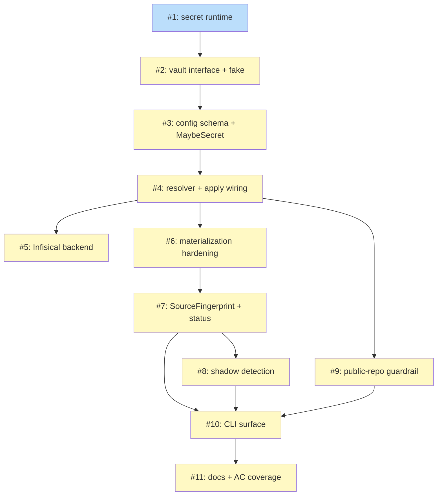

# PLAN: Vault Integration

## Status

Draft

## Scope Summary

Decompose the vault-integration design into 11 sequential implementation steps delivered as a single PR. Covers the secret runtime, pluggable vault providers (v1: Infisical), config schema extensions (`[vault.*]`, `env.vars`/`env.secrets` split, `MaybeSecret`), resolver stage wired into `apply.go`, materialization hardening (0o600 + `.local` + `.gitignore`), source fingerprinting, shadow detection, the public-repo plaintext guardrail, CLI surface (new flags + status subcommands), and docs.

## Decomposition Strategy

**Horizontal.** The design's 11 implementation phases are a layer-by-layer dependency chain (secret runtime → vault package → config schema → resolver → backend → materializer → fingerprint → shadows → guardrail → CLI → docs). Walking-skeleton would bundle phases 1–4 into one skeleton issue, but the layer boundaries are the natural atomic unit for single-pr outline density. Each outline maps to one package or materialization concern with ~5–17 testable acceptance criteria.

## Issue Outlines

### Issue 1: feat(secret): introduce secret.Value opaque type and error-wrap machinery

- **Complexity:** critical
- **Dependencies:** None
- **Goal:** Build `internal/secret/` with the opaque `Value` type, `Error` wrapper, context-scoped `Redactor`, and `secret.Wrap` / `secret.Errorf`. Add `internal/secret/reveal/UnsafeReveal` as the single plaintext-read entry point.
- **Key ACs:**
  - Every Go formatter (`%s`, `%v`, `%+v`, `%q`, `%#v`) emits `***`; `MarshalJSON` emits `"***"`; `MarshalText` emits `***`; `GobEncode` refuses with an error.
  - `secret.Wrap(err, values...)` registers fragment bytes on a per-context `Redactor` and returns a `secret.Error` that scrubs its `Error()`.
  - `secret.Error.Unwrap()` preserves the chain for `errors.Is` / `errors.As`.
  - `Redactor.Scrub` skips fragments < 6 bytes (MUST) and scrubs longest-first.
  - Acceptance test: wrap a secret through five `fmt.Errorf("...: %w", err)` layers; assert no secret bytes in top-level `Error()`.

### Issue 2: feat(vault): provider interface, registry, factory, and fake backend

- **Complexity:** testable
- **Dependencies:** 1
- **Goal:** Build `internal/vault/` core: Provider, Factory, Registry, Bundle, Ref, VersionToken, `ScrubStderr`, `ParseRef`, error catalog (`ErrKeyNotFound`, `ErrProviderUnreachable`, `ErrProviderNameCollision`, `ErrTeamOnlyLocked`), and a fake backend for tests.
- **Key ACs:**
  - `Provider` has `Name()`, `Kind()`, `Resolve(ctx, Ref) (secret.Value, VersionToken, error)`, `Close() error`.
  - Optional `BatchResolver` interface detected by runtime type-assertion.
  - `ParseRef` round-trips `vault://key` and `vault://name/key?required=false`; rejects malformed URIs.
  - `Bundle.CloseAll` invokes `Close()` on every opened provider.
  - Sentinel errors present; `DefaultRegistry` populated by backend `init()`.

### Issue 3: feat(config): vault schema, env.vars/env.secrets split, MaybeSecret type

- **Complexity:** testable
- **Dependencies:** 2
- **Goal:** Extend `internal/config/` with top-level `[vault.provider]` / `[vault.providers.<name>]`, `[env.vars]` / `[env.secrets]` split with `.required` / `.recommended` / `.optional` sub-tables, `workspace.vault_scope`, `[vault].team_only`, `GlobalOverride.Vault`, and `MaybeSecret` leaf type.
- **Key ACs:**
  - Parser rejects files that declare both `[vault.provider]` and `[vault.providers.*]`.
  - Parser rejects `vault://` URIs in `[claude.content.*]`, `[env.files]`, `[vault.provider*]` fields, and identifier fields.
  - Same vars/secrets split and sub-tables under `[claude.env]`.
  - `MaybeSecret` zero-value is "empty non-secret"; parser always produces `{Plain}` or omits entirely.
  - v0.6 configs without `[vault]` parse unchanged.

### Issue 4: feat(workspace): resolver stage and apply.go pipeline wiring

- **Complexity:** critical
- **Dependencies:** 3
- **Goal:** Build `internal/vault/resolver.go` with `ResolveWorkspace(ctx, cfg)` and `ResolveGlobalOverride(ctx, gco)`. Wire into `apply.go:runPipeline` between parse and merge. One-time fixture migration in `override_test.go` to wrap plaintext in `MaybeSecret{Plain: ...}`.
- **Key ACs:**
  - File-local scoping: per-file `Bundle` built from `cfg.Vault` only; no cross-file state.
  - R12 enforcement: personal overlay provider-name collision returns `ErrProviderNameCollision`.
  - R8 `team_only` check: personal overlay value for a locked key returns `ErrTeamOnlyLocked`.
  - `?required=false` downgrades missing to empty without error or warning.
  - `--allow-missing-secrets` downgrades to empty with stderr warning naming each key + provider.
  - Resolver auto-wraps plaintext values in `*.secrets` tables into `secret.Value`.
  - Integration test using `vault/fake` backend: parse → resolve → merge → materialize with a secret.

### Issue 5: feat(vault): Infisical backend with batch resolve and stderr scrub

- **Complexity:** critical
- **Dependencies:** 4
- **Goal:** Build `internal/vault/infisical/` — shells out to `infisical export --format json` once per project (implements `BatchResolver`). Stderr scrubbed via `vault.ScrubStderr` before wrapping in `secret.Errorf`.
- **Key ACs:**
  - No secret values ever on argv, no `os.Setenv` with secrets, `exec.Cmd.Env = nil` (inherit).
  - `VersionToken.Token` = Infisical secret-version ID; `Provenance` = audit-log URL.
  - R22 acceptance test: craft an Infisical mock emitting a known-secret-fragment on auth-failure stderr; assert the fragment is NOT present in the returned error's `Error()`.
  - Auth errors map to `ErrProviderUnreachable`; key-not-found maps to `ErrKeyNotFound`.
  - Registered with `DefaultRegistry` via backend `init()`.

### Issue 6: feat(workspace): materialization hardening (0o600, .local infix, .gitignore)

- **Complexity:** testable
- **Dependencies:** 4
- **Goal:** Modify `EnvMaterializer`, `SettingsMaterializer`, `FilesMaterializer` to consume `MaybeSecret` and write `0o600` unconditionally (fixes pre-existing `0o644` bug). Enforce `.local` filename infix. `niwa create` maintains instance-root `.gitignore` covering `*.local*` (idempotent).
- **Key ACs:**
  - All three materializers write `0o600` regardless of vault presence (bug fix applies to non-vault users too).
  - Every secret-bearing materialized file has `.local` in its filename.
  - `niwa create` twice produces the same `.gitignore` content (idempotent).
  - Functional test: pre-existing config without vault now writes 0o600.

### Issue 7: feat(workspace): SourceFingerprint and per-source tuples in state.json

- **Complexity:** testable
- **Dependencies:** 6
- **Goal:** Add `ManagedFile.SourceFingerprint` (SHA-256 rollup) and `Sources []SourceEntry` (tuple list). Bump `InstanceState.SchemaVersion` 1 → 2 with backwards-compatible load. `niwa status` reports `drifted` / `stale` / `ok` with per-source attribution.
- **Key ACs:**
  - `SourceEntry{Kind, SourceID, VersionToken, Provenance}` — all strings; `Kind ∈ {plaintext, vault}`.
  - v1 states load via migration shim that zeros `Sources[]` (and `Shadows[]` from Issue 8).
  - `niwa status` default is fully offline; does NOT invoke providers.
  - Stale output includes provenance (git SHA or audit-log URL) per backend.
  - Functional tests: drift-only, vault-rotated, mixed-source scenarios.

### Issue 8: feat(workspace): shadow detection and diagnostics across apply/status

- **Complexity:** testable
- **Dependencies:** 7
- **Goal:** Build `workspace.DetectShadows` (env/files) and `vault.DetectProviderShadows` (provider names). Persist `InstanceState.Shadows []Shadow`. `niwa status` summary line + `--audit-secrets` SHADOWED column.
- **Key ACs:**
  - `Shadow` struct has no `secret.Value` field (compile-time verified).
  - Provider shadow emitted BEFORE the R12 hard error.
  - Stderr format: `shadowed <kind> <name> [personal-overlay shadows team: team=<path>, personal=<path>]`. No values printed.
  - R22 functional test: full stderr capture contains no secret bytes.

### Issue 9: feat(guardrail): public-repo plaintext-secrets hard block

- **Complexity:** critical
- **Dependencies:** 4
- **Goal:** Build `internal/guardrail/` package. Enumerate ALL remotes via `git remote -v`, match GitHub HTTPS/SSH patterns, walk team `*.secrets` for plaintext. Block apply unless `--allow-plaintext-secrets` (strictly one-shot).
- **Key ACs:**
  - Entry point narrowly named `CheckGitHubPublicRemoteSecrets` (not generic).
  - `internal/config/` stays ignorant of git (architect S-1).
  - `--allow-plaintext-secrets` is strictly one-shot: apply twice without the flag, guardrail fires both times.
  - `origin`-private + `upstream`-public GitHub scenario triggers the guardrail.
  - `github.com` (case-insensitive) matches; `github.mycorp.com`, `gitlab.com`, `bitbucket.org` do NOT.
  - No `.git` working tree → warning + proceed.

### Issue 10: feat(cli): vault flags, status subcommands, bootstrap pointer

- **Complexity:** testable
- **Dependencies:** 7, 8, 9
- **Goal:** Add `--allow-missing-secrets` and `--allow-plaintext-secrets` flags to `niwa apply`. Add `niwa status --audit-secrets` and `niwa status --check-vault` subcommands. `niwa init` emits post-clone vault bootstrap pointer.
- **Key ACs:**
  - `--allow-missing-secrets` does NOT downgrade `*.required` misses (R34).
  - `niwa status --audit-secrets` exits non-zero when plaintext found AND a vault is configured; exits 0 otherwise.
  - `--audit-secrets` SHADOWED column shows `yes (personal-overlay[, scope=<s>])` or `no`.
  - `niwa status --check-vault` re-resolves but does NOT materialize.
  - Default `niwa status` stays fully offline.

### Issue 11: docs(vault): bootstrap walkthrough and acceptance coverage

- **Complexity:** simple
- **Dependencies:** 10
- **Goal:** Write `docs/guides/vault-integration.md` with end-to-end Infisical bootstrap walkthrough. Document the PRD acceptance-criteria matrix. Call out v1 scope boundaries.
- **Key ACs:**
  - Guide includes Infisical bootstrap targeting < 2 minutes end-to-end.
  - Guide documents the anonymous-singular vs named-multiple schema, `vars`/`secrets` split, requirement sub-tables.
  - Guide includes plaintext-to-vault migration walkthrough (no `niwa vault import` tool in v1).
  - Guide calls out GitHub-only guardrail detection and Windows-via-WSL-only support.
  - AC coverage matrix: every PRD AC line mapped to an implementing test file.

## Dependency Graph

**Legend:** Blue = ready, Yellow = blocked.

## Implementation Sequence

**Critical path:** 1 → 2 → 3 → 4 → 6 → 7 → 8 → 10 → 11 (9 hops).

**Choke points:** Issue 4 is the central fan-out (Issues 5, 6, 9 all build on it). Issue 10 is the fan-in for 7, 8, 9.

**Parallelization (informational for single-pr):** Issues 5, 6, 9 could theoretically proceed in parallel against a stable Issue 4 base.

**Recommended commit order within the single PR:**

1. Issue 1 (secret runtime)
2. Issue 2 (vault interface + fake backend)
3. Issue 3 (config schema + MaybeSecret)
4. Issue 4 (resolver + apply wiring + merge-test fixture migration)
5. Issue 6 (materializer hardening — may also land as a precursor PR for the `0o600` fix alone)
6. Issue 5 (Infisical backend)
7. Issue 7 (SourceFingerprint + state schema v2)
8. Issue 9 (public-repo guardrail)
9. Issue 8 (shadow detection)
10. Issue 10 (CLI surface)
11. Issue 11 (docs)

**Release coupling:** Issues 4 (resolver + `MaybeSecret` leaf) and 6 (materializer consumption of `MaybeSecret`) form one logical release unit. Intermediate builds that ship Issue 4 without Issue 6 would have materializers that cannot handle the new field shape. Land together, or keep Issue 6 behind a feature flag that preserves the old flat-string materialization path. The `0o600` bug-fix portion of Issue 6 is independent and strictly safer for non-vault configs.

**State schema migration:** Issues 7 and 8 jointly bump `InstanceState.SchemaVersion` 1 → 2 (Issue 7 adds `Sources[]`; Issue 8 adds `Shadows[]`). v2 writes are unconditional after Issue 7 lands. Document in the release notes that downgrading to a pre-Issue-7 binary after apply fails to parse `state.json`.
