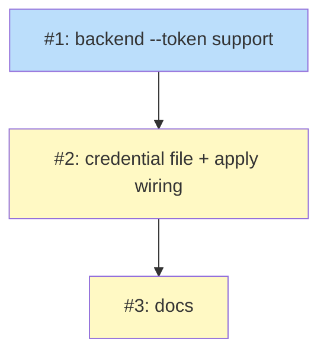

# PLAN: Vault Multi-Org Auth

## Status

Draft

## Scope Summary

Add optional per-provider machine-identity auth so niwa's Infisical
backend can resolve secrets across multiple Infisical organizations in
a single apply. Three issues: backend `--token` support, credential
file reading + token injection in apply.go, and docs update.

## Decomposition Strategy

**Horizontal.** The design's three implementation phases are a clean
layer-by-layer chain: backend change → apply-layer wiring → docs. Each
phase builds on the previous with no parallelism needed.

## Issue Outlines

### Issue 1: feat(vault): Infisical backend --token support

- **Complexity:** testable
- **Dependencies:** None
- **Goal:** Add optional `token` field to the Infisical Provider,
  read from `ProviderConfig["token"]` in `Factory.Open`, and
  conditionally append `--token <jwt>` to `runInfisicalExport` args
  when the token is non-empty. Falls back to CLI session when empty.
- **Key ACs:**
  - `Factory.Open` reads optional `config["token"]` string; stores on
    `Provider.token`.
  - `runInfisicalExport` accepts a `token string` parameter. When
    non-empty, appends `"--token", token` to the args slice before
    `"--format"`.
  - When token is empty, args are unchanged (current behavior).
  - Unit test: with-token args include `--token <value>`.
  - Unit test: without-token args match the current shape.
  - Integration test (if `INFISICAL_TEST_PROJECT_ID` set): resolve
    via `--token` with a machine-identity JWT obtained from the
    test project's CI identity.

### Issue 2: feat(workspace): credential file reading + token injection

- **Complexity:** critical
- **Dependencies:** 1
- **Goal:** Read `~/.config/niwa/provider-auth.toml` (if it exists)
  once per apply in `apply.go`. Parse `[[providers]]` entries grouped
  by `kind`. For each ProviderSpec, hand matching entries to the
  backend for authentication. Infisical backend matches by `project`
  and authenticates via HTTP POST to the universal-auth endpoint.
  Inject the returned JWT into `ProviderConfig["token"]`.
- **Key ACs:**
  - New type `ProviderAuthEntry` with `Kind`, `Config map[string]any`
    fields (generic envelope).
  - `loadProviderAuth(configDir string) ([]ProviderAuthEntry, error)`
    reads and parses the TOML file. Returns nil if file absent
    (not an error). Returns error if file exists but permissions are
    not 0o600.
  - New `Authenticator` interface or function type:
    `func(ctx, providerSpec, []ProviderAuthEntry) (token string, err error)`.
    The Infisical backend registers its implementation (match by
    `project`, HTTP POST for JWT). Other backends can register their
    own in the future.
  - `authenticateInfisical(ctx, spec, entries) (string, error)` does
    the HTTP POST to `api_url + "/v1/auth/universal-auth/login"`
    (defaulting to `https://app.infisical.com/api`). Scrubs errors
    via `secret.Errorf`.
  - `apply.go:runPipeline` calls `loadProviderAuth` + iterates specs +
    injects tokens before `BuildBundle`.
  - Permission check: file at non-0o600 → clear error message telling
    user to `chmod 0600`.
  - File absent → single-org path (no token injection, no error).
  - Unit test: loadProviderAuth with valid file, absent file, wrong
    permissions.
  - Unit test: authenticateInfisical with HTTP mock (success, auth
    failure, network error).
  - Unit test: injectProviderTokens matches by (kind, project) and
    sets Config["token"].
  - Acceptance test: client_secret does NOT appear in any error
    message when HTTP POST fails.
  - Integration test: end-to-end apply with credential file resolving
    a secret from a non-CLI-session org.

### Issue 3: docs(vault): multi-org setup walkthrough

- **Complexity:** simple
- **Dependencies:** 2
- **Goal:** Update `docs/guides/vault-integration.md` with a multi-org
  setup section. Document the credential file format, per-org machine
  identity setup, and the "login to one org + credential file for the
  rest" pattern.
- **Key ACs:**
  - New section in vault-integration guide: "Multi-Org Setup"
  - Documents `~/.config/niwa/provider-auth.toml` format with
    examples for 2-org and 3-org scenarios.
  - Documents the "login to personal org + credential file for team
    orgs" pattern explicitly.
  - Documents machine identity creation steps in the Infisical
    dashboard (create identity → add universal auth → create client
    secret → copy to credential file).
  - Documents `api_url` for self-hosted Infisical.
  - Notes that backends that don't need credential entries (sops,
    single-org Infisical with CLI login) simply omit them.

## Dependency Graph

**Legend:** Blue = ready, Yellow = blocked.

## Implementation Sequence

**Critical path:** 1 → 2 → 3 (3 hops, linear).

**Recommended commit order:**
1. Issue 1 (backend --token support)
2. Issue 2 (credential file + apply wiring + HTTP auth)
3. Issue 3 (docs)

Estimated total: ~85 lines of new code + ~50 lines of tests + docs update.
