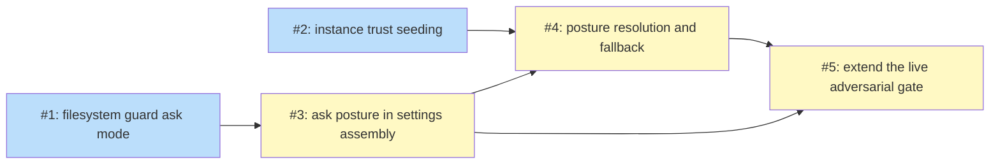

# PLAN: operator-approval for out-of-instance writes in sandboxed review sessions

## Status

Draft

Single-pr plan implementing `docs/designs/DESIGN-watch-operator-approval.md`
(issue [#201](https://github.com/tsukumogami/niwa/issues/201)). All five issues land
in one PR against `tsukumogami/niwa`.

## Scope Summary

The shipped `niwa watch --once` sandbox (`watch_sandbox = required`) hard-denies an
out-of-instance Write/Edit/MultiEdit/NotebookEdit. This plan adds an operator-approval
(ask) posture on top of that deny: the sandboxed review session runs under
`permissions.defaultMode = "default"` with instance trust seeded in `~/.claude.json`
and auto-allow hooks for the normal review tools, so the filesystem guard's
out-of-instance ask is honored and surfaces as an approve/deny decision in the
`claude agents` view, failing closed if unanswered. The hard deny is kept verbatim as
the fail-closed fallback whenever niwa cannot guarantee the two prerequisites (a
trusted workspace, and an instance not under `~/.claude`). Network egress and Bash
egress stay denied under the new mode, and the live adversarial gate is extended to
assert both the surfaced pending approval and the absent-file fail-closed outcome.

The design's decisions are taken as given; this plan names the files and acceptance
criteria, not new architecture.

## Decomposition Strategy

**Horizontal, bottom-up.** The change is one feature but layers cleanly: the two
leaf capabilities (the guard's ask mode and the trust seed) have no dependencies and
can be built first; the settings assembly composes the guard's new hook shape; the
`stageReview` posture resolver composes the trust seed and the settings assembly; the
live gate exercises the whole assembled posture last. Five atomic issues, four
cross-issue edges. Each issue carries its own unit coverage except the live gate,
which is opt-in and exercises the composed posture end-to-end.

Grouping rule: one issue per code seam that carries its own unit test (guard
decision, trust store, settings assembly, CLI posture resolver, live gate).

## Issue Outlines

### Issue 1: filesystem guard ask mode

**Complexity**: testable

**Goal**: Give the filesystem guard a second decision mode that emits an operator
ask for an out-of-instance write and an explicit allow for an in-instance one,
without weakening any fail-closed path or changing the shipped deny mode.

**Acceptance Criteria**:
- `GuardFSDecision` takes an `askOutside bool` (or an equivalent mode value) and a
  stdout writer.
- With `askOutside=false` the behavior is unchanged: exit 0 in-instance, exit 2
  out-of-instance, exit 2 on every fail-closed input, no stdout decision.
- With `askOutside=true`: an in-instance target prints a well-formed PreToolUse
  `permissionDecision:"allow"` object to stdout and exits 0; a cleanly-resolved
  out-of-instance target prints `permissionDecision:"ask"` and exits 0.
- With `askOutside=true` every fail-closed input (unreadable stdin, unparseable JSON,
  missing target path, undeterminable root) still exits 2 with no allow/ask emitted.
- The hidden `niwa watch guard-fs` command gains an `--ask-outside` flag that selects
  the ask mode; default (flag absent) is the deny mode.
- Unit tests cover allow-in-instance-JSON, ask-out-of-instance-JSON, and
  fail-closed-deny under `askOutside=true`, plus the unchanged deny-mode cases.

**Dependencies**: None

**Type**: code

**Files**: `internal/watch/guardfs.go`, `internal/cli/watch_guard.go`,
`internal/watch/guardfs_test.go`

---

### Issue 2: instance trust seeding

**Complexity**: testable

**Goal**: Let niwa mark an ephemeral instance path as a trusted Claude Code workspace
by seeding `~/.claude.json`, and remove that entry when the instance is reclaimed,
without disturbing any other content in that file.

**Acceptance Criteria**:
- `EnsureInstanceTrusted(instancePath)` adds a `projects[<realpath>]` entry with
  `hasTrustDialogAccepted: true` and `hasTrustDialogHooksAccepted: true` to the
  `~/.claude.json` under the resolved HOME, creating the file if absent and preserving
  every pre-existing key and project entry.
- The write is atomic (temp file plus rename) so a partial write cannot corrupt the
  file.
- `RemoveInstanceTrust(instancePath)` removes only that one `projects` entry and
  preserves the rest; a missing entry or missing file is a no-op, not an error.
- An unresolvable HOME returns an error (so the caller can fall back to hard deny);
  the HOME lookup is a seam a test can override.
- Unit tests cover: seeding into an absent file, seeding into a populated file
  without clobbering siblings, idempotent re-seeding, removal, and the
  unresolvable-HOME error, using a temp HOME.

**Dependencies**: None

**Type**: code

**Files**: `internal/watch/trust.go` (new), `internal/watch/trust_test.go` (new)

---

### Issue 3: ask posture in settings assembly

**Complexity**: critical

**Goal**: Teach the review-settings assembly to build the ask posture and verify it,
while keeping the hard-deny posture identical to what PR #198 shipped.

**Acceptance Criteria**:
- `ApplyReviewSettings` gains an ask-posture selector. When the ask posture is on and
  `sandbox` is true it writes `permissions.defaultMode = "default"` (fully owned,
  overriding any inherited value), appends a `Bash/Read/Glob/Grep` auto-allow
  PreToolUse hook emitting `permissionDecision:"allow"`, and wires the
  filesystem-guard hook with `--ask-outside`.
- When the ask posture is off, the emitted settings are byte-for-byte the current
  hard-deny shape: no `permissions.defaultMode`, no auto-allow hook, the guard hook in
  its exit-code wrapper form.
- `VerifyReviewSettings` re-verifies the posture-appropriate shape: in the ask posture
  it requires `defaultMode == "default"`, the auto-allow hook, and the fs-guard hook;
  it keeps the egress-deny and post-guard requirements in both postures.
- The auto-allow and post-guard hooks coexist so a normal Bash call is allowed while
  `gh pr review`/`gh pr comment` is still denied.
- Docstrings that assert "hard deny, not an ask" are updated to describe both postures.
- Unit tests cover the ask-posture settings shape, the unchanged hard-deny shape, and
  the posture-appropriate verify assertions.

**Dependencies**: <<ISSUE:1>>

**Type**: code

**Files**: `internal/watch/containment.go`, `internal/watch/containment_test.go`

---

### Issue 4: posture resolution and fallback in stageReview

**Complexity**: testable

**Goal**: Decide, per instance and before launch, whether the ask posture's
prerequisites hold; use it when they do and fall back to the shipped hard deny when
they do not; report the posture; and clean up the trust entry on destroy.

**Acceptance Criteria**:
- In sandbox mode, `stageReview` resolves the real HOME, asserts the instance path is
  not under `<HOME>/.claude`, and calls `EnsureInstanceTrusted`. If all succeed it
  applies the ask posture; if any step fails it applies the hard-deny posture. The
  no-sandbox path is unchanged.
- The trust entry is removed (best-effort, non-fatal) when the instance is destroyed
  on a staging failure, mirroring the existing cleanup.
- The run reports which posture is in force (extend the `posture()` string or the
  per-run output) so the operator knows whether approval or hard deny applies.
- A hard-deny fallback never sets `defaultMode = "default"` and never leaves a trust
  entry behind.
- Unit tests cover: prerequisites-met yields the ask posture, a trust-seed failure
  yields the hard-deny fallback, and an instance under `~/.claude` yields the
  hard-deny fallback, using the existing seams.

**Dependencies**: <<ISSUE:2>>, <<ISSUE:3>>

**Type**: code

**Files**: `internal/cli/watch.go`, `internal/cli/watch_test.go`

---

### Issue 5: extend the live adversarial gate

**Complexity**: critical

**Goal**: Prove the assembled ask posture end-to-end on a live harness: the
out-of-instance write both fails closed and surfaces an actionable pending approval,
while the egress channels stay denied.

**Acceptance Criteria**:
- The gate assembles the ask posture (ask-posture `ApplyReviewSettings`,
  `defaultMode = "default"`, instance trust seeded via `EnsureInstanceTrusted`, trust
  removed on cleanup) instead of patching `bypassPermissions`.
- The probe is ordered so the WebFetch/MCP/raw-socket results are recorded before the
  out-of-instance write (which blocks pending approval); the gate then asserts the
  three egress channels are denied.
- The gate asserts the out-of-instance file is absent after the run (fail-closed),
  the existing authoritative filesystem check.
- The gate asserts the pending approval surfaced: `claude agents --json` reports the
  session waiting on a permission prompt (for example `status:"waiting"` with
  `waitingFor` naming a permission prompt). The assertion tolerates absence
  defensively and the gate stays opt-in (`NIWA_WATCH_LIVE_TEST=1`), never a false pass.
- The session is stopped and the trust entry removed on teardown.

**Dependencies**: <<ISSUE:3>>, <<ISSUE:4>>

**Type**: code

**Files**: `internal/watch/adversarial_test.go`

---

## Dependency Graph

**Legend**: Green = done, Blue = ready, Yellow = blocked

## Implementation Sequence

Open with the two dependency-free leaves in parallel: **#1** (guard ask mode) and
**#2** (trust seeding). Then **#3** (settings assembly), which composes #1's new hook
shape. Then **#4** (posture resolution), which composes #2 and #3. Finish with **#5**
(the live adversarial gate), which exercises the fully assembled posture. Run
`go test ./...`, `go vet ./...`, and the build after each layer; the opt-in live gate
(#5) is compiled by `go test ./...` but only enforces on a host with
`NIWA_WATCH_LIVE_TEST=1` and the Claude Code OS sandbox.

## References

- `docs/designs/DESIGN-watch-operator-approval.md` -- the upstream design.
- `docs/designs/current/DESIGN-niwa-watch-once-pr-review.md` -- the shipped
  watch-once containment this refines.
- Issue [#201](https://github.com/tsukumogami/niwa/issues/201) -- the operator-approval
  request and its Step-1 feasibility spike (PROCEED).
