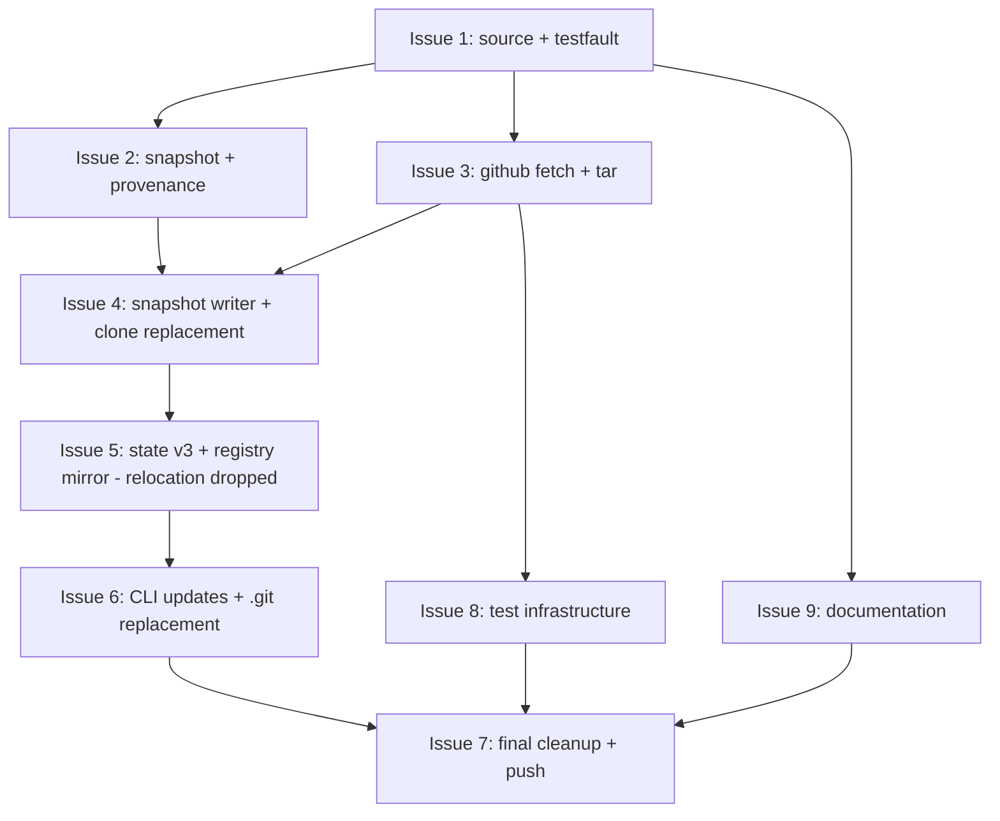

# PLAN: Workspace Config Sources

## Status

Done

## Amendments

### 2026-04-23 — Drop instance.json relocation

What changed: Issue 5's scope shrinks. The relocation work
(`.niwa-state/` rename, dual-path lookup, lazy migration on first save)
is no longer planned. Schema bump to v3 and registry mirror fields
remain. PR #73's `preserveInstanceState` helper (which copies
`instance.json` into the staging dir before the atomic swap) is the
permanent solution.

Why: the relocation was implementation-driven — its only purpose was
to keep state safe across a wholesale snapshot swap. The simpler
solution (assembly step copies state into staging before swap)
achieves the same safety without splitting the user-visible workspace
into two hidden directories. See PRD/DESIGN amendments for the full
reasoning.

Effect on critical path: Issue 5's tasks shrink to docs cleanup and
test additions. The Mermaid diagram below is unchanged from the
original; only Issue 5's contents change.

Issue #74 (`needs-design`) captures a longer-term improvement
(convention-aware fetch — pull only files niwa knows about instead of
the whole subpath). That work is out of scope for this branch.

## Scope Summary

Implements the design doc's 11 implementation phases as 9 atomic issue
outlines, all landing on a single PR (the same PR carrying the PRD and
design). Single-pr mode per the user's "all in this same branch"
instruction; no GitHub issues or milestone created.

Per the 2026-04-23 amendment, Issue 5 below has its scope reduced
(relocation tasks removed; schema bump and registry mirror remain).

## Decomposition Strategy

**Horizontal** (layer-by-layer). The design's package boundaries are
already crisp — `internal/source/` is a leaf, `internal/testfault/` is
a leaf, the snapshot primitive composes both, the GitHub fetch path
extends an existing package, and the CLI surface composes everything.
Walking-skeleton was considered but rejected: integration risk is
manageable because each layer has a well-defined interface (per the
design's Key Interfaces section), and the failure modes are testable
at each layer's boundary. A horizontal sequence lets each layer be
fully unit-tested before the next consumes it.

The decomposition follows the design's Implementation Approach
verbatim, with the design's Phase 1+2 collapsed into one issue
(both leaf packages of similar small scope) and the design's Phases
9-10 collapsed into "CLI updates + .git replacement" (related concerns
touching the same set of CLI files).

## Implementation Sequence

Critical path runs Issue 1 → 2 → 3 → 4 → 5 → 6 → 7. Issues 8 (test
infrastructure) and 9 (documentation) can land in parallel with Issues
4-7 once the foundation (Issues 1-3) is in place.

## Issue Outlines

### Issue 1: Foundation packages (`internal/source/`, `internal/testfault/`)

**Complexity**: testable
**Status**: ✅ Done

**Goal**: build two leaf packages that the rest of the redesign
depends on. `internal/source/` is the canonical slug parser
(typed `Source` struct, `Parse`/`String` round-trip, methods for
clone/tarball/commits URLs and overlay derivation). `internal/testfault/`
is the test-only fault-injection seam (`Maybe(label)` reads
`NIWA_TEST_FAULT`).

**Dependencies**: none

**Acceptance criteria**:
- [x] `internal/source/source.go` defines `Source` struct with five fields (Host, Owner, Repo, Subpath, Ref) and methods `String`, `CloneURL`, `TarballURL`, `CommitsAPIURL`, `OverlayDerivedSource`, `DisplayRef`.
- [x] `internal/source/parse.go` defines `Parse(string) (Source, error)` that satisfies PRD R3 strict parsing rules: rejects empty subpath after colon, malformed separator order, embedded whitespace, multiple `:` separators, multiple `@` separators.
- [x] Round-trip exact for whole-repo slugs: `Parse(s).String() == s` for `s = "org/repo"`, `"org/repo@v1"`, `"org/repo:.niwa"`, `"org/repo:.niwa@v1"`.
- [x] `internal/source/source_test.go` table-driven coverage of all R3 rejection cases plus round-trip property.
- [x] `internal/testfault/testfault.go` defines `Maybe(label string) error` that returns nil unless `NIWA_TEST_FAULT` matches a fault spec for the label; spec format `<spec>@<label>[,<spec>@<label>]*`; supported specs `truncate-after:N`, `error:<message>`.
- [x] `internal/testfault/testfault_test.go` covers default (env unset) no-op, single fault, multiple labels, malformed spec.
- [x] Tests pass via `go test ./internal/source/... ./internal/testfault/...`.

### Issue 2: Snapshot primitive + provenance marker

**Complexity**: critical
**Status**: ✅ Done

**Goal**: build the atomic-swap primitive and the provenance marker
reader/writer. These are the workspace-package primitives that all
three clone sites compose with.

**Dependencies**: Issue 1 (uses `internal/testfault.Maybe`)

**Acceptance criteria**:
- [x] `internal/workspace/snapshot.go` defines `swapSnapshotAtomic(target, staging string) error` implementing the two-rename swap with idempotent preflight cleanup of stale `.next/.prev/`.
- [x] The swap calls `testfault.Maybe("snapshot-swap")` at start; injected faults leave the previous snapshot intact (preflight on next call cleans up).
- [x] `internal/workspace/snapshot_test.go` covers happy path, preflight cleanup of stale dirs, fault-injection mid-swap, target-doesn't-exist (treats as fresh staging-only swap).
- [x] `internal/workspace/provenance.go` defines `Provenance` struct, `WriteProvenance(snapshotDir string, p Provenance) error`, and `ReadProvenance(snapshotDir string) (Provenance, error)`. TOML format at `.niwa-snapshot.toml`.
- [x] Marker fields: `source_url`, `host`, `owner`, `repo`, `subpath`, `ref`, `resolved_commit`, `fetched_at` (RFC 3339), `fetch_mechanism`.
- [x] `internal/workspace/provenance_test.go` covers round-trip, missing required fields, malformed TOML.
- [x] Constants added: `SnapshotDir = ".niwa"` (per the 2026-04-23 amendment, `StateDir` keeps its `.niwa` value — no rename — and shares the directory with the snapshot; the assembly step in Issue 4 carries `instance.json` through the swap).
- [x] Tests pass via `go test ./internal/workspace/...`.

### Issue 3: GitHub fetch + tar extraction

**Complexity**: critical
**Status**: ✅ Done

**Goal**: extend `internal/github/APIClient` with the two new
methods and add the streaming tar extractor with all 7 security
defenses from the design's Security Considerations section.

**Dependencies**: Issue 1 (calls `testfault.Maybe`)

**Acceptance criteria**:
- [x] `APIClient.HeadCommit(ctx, owner, repo, ref, etag) (oid, newETag string, statusCode int, err error)` issues `GET /repos/{owner}/{repo}/commits/{ref}` with `Accept: application/vnd.github.sha`.
- [x] `APIClient.FetchTarball(ctx, owner, repo, ref, etag) (body io.ReadCloser, newETag string, statusCode int, redirect *RenameRedirect, err error)` issues `GET /repos/{owner}/{repo}/tarball/{ref}` with `If-None-Match: <etag>` when etag is non-empty; follows 301 once with chain inspection for `RenameRedirect{OldOwner, OldRepo, NewOwner, NewRepo}`.
- [x] `NewAPIClient()` reads `NIWA_GITHUB_API_URL` env var when set; defaults to `https://api.github.com`. `GH_TOKEN` read once at construction.
- [x] `internal/github/tar.go` exports `ExtractSubpath(r io.Reader, subpath, dest string) error` enforcing all 7 security defenses: positive type allowlist (TypeReg, TypeDir only), wrapper anchoring, subpath filter, path-containment check, filename validation (no NUL/`..`/leading-`/`/non-`/` separators), 500 MB decompression-bomb cap with per-entry and cumulative tracking via `io.LimitReader`.
- [x] Calls `testfault.Maybe("fetch-tarball")` at request start, `testfault.Maybe("extract-entry")` per tar entry.
- [x] `internal/github/client_test.go` and `internal/github/tar_test.go` cover both with httptest.Server (no live GitHub calls).
- [x] Token never appears in error messages, log lines, or surfaced types (security invariant).
- [x] Tests pass via `go test ./internal/github/...`.

### Issue 4: Snapshot writer + clone-primitive replacement

**Complexity**: critical
**Status**: ✅ Done (decided via /decision: Option A full replacement)

**Goal**: rewrite the three clone sites (`SyncConfigDir`,
`CloneOrSyncOverlay`, init's `Cloner.CloneWith` invocation) to compose
source + fetch + extract + provenance + atomic swap. Add the git-clone
fallback for non-GitHub hosts.

**Dependencies**: Issues 2 + 3

**Acceptance criteria**:
- [x] `internal/workspace/configsync.go` DELETED — `SyncConfigDir` was the carrier for legacy `git pull --ff-only`; `EnsureConfigSnapshot` is now the only sync strategy.
- [x] `internal/workspace/overlaysync.go` rewritten as `EnsureOverlaySnapshot(ctx, urlSlug, dir, fetcher, reporter) (wasFreshClone, err)`; overlays write provenance markers and refresh through the same pipeline; silently skip on fetch failure for first clone.
- [x] `internal/workspace/fallback.go` (new) implements `FetchSubpathViaGitClone`: shallow clone to `os.MkdirTemp`, copies subpath into staging with `ExtractSubpath`-equivalent security (regular files only, path containment, .git stripped, per-file size cap), removes temp dir on success.
- [x] All three clone sites call `SwapSnapshotAtomic` to land the snapshot at canonical path.
- [x] No `git pull --ff-only` invocations remain in config-dir or overlay code (only `internal/workspace/sync.go:86` for `kind: clone` workspace user repos, scope-documented and out of scope).
- [x] `Cloner.CloneWith` call site in `internal/cli/init.go` replaced by `MaterializeFromSource`.
- [x] `Cloner.Clone` call site in `internal/cli/config_set.go` replaced by `MaterializeFromSource` (personal overlay also gets a marker).
- [x] `preserveInstanceState` helper carries `instance.json` through the swap (the simple-solution-per-user-direction; replaces the originally-planned `.niwa-state/` relocation per the 2026-04-23 amendment).
- [x] `go test ./internal/workspace/...` passes; existing tests adapted; new `fallback_test.go` covers whole-repo extraction, subpath filtering, missing-subpath rejection, symlink-skip, traversal rejection, `splitLocalPath`.

### Issue 5: State schema v3 + registry mirror fields

**Complexity**: testable
**Status**: ✅ Done

> **Amended 2026-04-23.** Original scope included relocating `instance.json`
> to `<workspace>/.niwa-state/` with dual-path lookup and lazy migration.
> Per the PRD/DESIGN amendment, that relocation is no longer planned —
> `instance.json` stays at `<workspace>/.niwa/instance.json` and is
> carried through the snapshot swap by Issue 4's `preserveInstanceState`
> helper. The schema bump and registry mirror work below remain in scope.

**Goal**: bump `InstanceState` to schema v3 with `config_source` block;
add registry mirror fields with lazy migration on next save.

**Dependencies**: Issue 4 (consumes Source type in registry mirror
fields)

**Acceptance criteria**:
- [x] `InstanceState.SchemaVersion` bumps to 3; new `ConfigSource *ConfigSource` field with the documented 8-tuple plus URL.
- [x] v2 state files load successfully and lazy-upgrade on next save (per PRD R24, R34).
- [x] `schema_version > 3` rejected with diagnostic naming both versions; on-disk file unchanged.
- [x] `RegistryEntry` gains `SourceHost`, `SourceOwner`, `SourceRepo`, `SourceSubpath`, `SourceRef` fields with `omitempty`. Lazy-populate from `source_url` on read; persist on next save with stderr warning if mirror disagreed (per PRD R22).
- [x] `internal/workspace/state_v3_test.go` covers v2→v3 lazy migration (preserves unrelated fields per PRD AC-X1) and forward-version rejection.
- [x] `internal/config/registry_mirror_test.go` covers lazy mirror upgrade, mirror reconciliation when hand-edited.
- [x] All existing `go test ./...` continues to pass.

**Remaining work**: ✅ none.
- [x] Deleted the `TODO(workspace-config-sources Issue 5)` comment in `internal/workspace/state.go:19`; replaced with explanatory text noting StateDir intentionally shares its value with SnapshotDir.
- [x] Added `TestEnsureConfigSnapshot_PreservesInstanceStateAcrossRefresh` and `TestEnsureConfigSnapshot_NoStateFileToPreserveIsBenign` to `snapshotwriter_test.go` to lock the carry-over contract.

### Issue 6: CLI updates + `.git/` replacement + overlay discovery

**Complexity**: critical
**Status**: ✅ Done

**Goal**: wire the canonical `Source` parser through the CLI surface;
implement R26-R28 migration UX; replace the two `.git/`-dependent
guards; implement R35 overlay slug derivation; update `niwa status`.

**Dependencies**: Issue 5

**Acceptance criteria**:
- [x] `niwa init`: parses `--from <slug>` via `internal/source.Parse`; uses snapshot writer; writes registry with parsed mirror fields.
- [x] `niwa config set global`: same parsing + snapshot writer for the personal overlay clone (covered under Issue 4 with `MaterializeFromSource`).
- [x] `niwa apply`: detects URL change against the on-disk provenance marker; refuses without `--force` when the on-disk dir is a legacy working tree (R26-R27); validates new source's `[workspace].name` matches registered name (R27 — `apply.go:319-323`); same-URL legacy working trees lazy-convert without `--force` (R28).
- [x] R28 lazy conversion notice fires once per workspace, gated on `DisclosedNotices`. `EnsureConfigSnapshotWithStatus` returns whether a conversion happened; apply.go appends `noticeConfigConverted` to `result.disclosedNotices` so the disclosure is persisted with the next state save.
- [x] `niwa apply --allow-dirty` succeeds with stderr deprecation notice naming v1.1 removal (R32); notice printed once per process invocation.
- [x] `niwa status` detail view displays source line with `(default branch)` annotation when ref-less (R20).
- [x] `niwa status` displays overlay slug on its own line when an overlay was discovered (R36). Keyed off `state.OverlayURL`; suppressed for `--no-overlay` and silent-skip cases.
- [x] `niwa reset`'s `isClonedConfig` reads provenance marker instead of `.git/` (R30); displays the URL it's about to re-fetch from.
- [x] `internal/guardrail/githubpublic.go` `CheckGitHubPublicRemoteSecrets` reads provenance marker tuple instead of `git remote -v` (R31); fail-open on missing marker.
- [x] Auto-discovered workspace overlay slug derived via `Source.OverlayDerivedSource()` per R35 (basename + `-overlay` rule).
- [x] `internal/cli/apply_url_change_test.go` covers URL-change detection paths.
- [x] All `go test ./...` passes.

**Remaining work**: ✅ none. Both pending items addressed in this PR — see ACs above. As a side effect, fixed a latent bug in `saveWorkspaceRootDisclosures` that was writing notice state outside the workspace sandbox in single-instance layouts (the bug surfaced when the new R28 notice exposed it).

### Issue 7: Final cleanup + push

**Complexity**: simple
**Status**: ✅ Done

**Goal**: run all checks, clean up wip/, transition PRD + design to
Done, push final commit.

**Dependencies**: Issues 5, 6, 8, 9 all complete

**Acceptance criteria**:
- [x] `go fmt ./...`, `go vet ./...`, `go test ./...` all clean.
- [x] `make test-functional` clean.
- [x] `wip/` empty.
- [x] PRD frontmatter + body status transitioned: In Progress → Done.
- [x] Design frontmatter + body status transitioned: Accepted → Done. (Moved the file into `docs/designs/current/`.)
- [x] PLAN frontmatter + body status transitioned: Active → Done.
- [x] Final commit pushed; PR description updated.

### Issue 8: Test infrastructure (`tarballFakeServer`, scenarios)

**Complexity**: testable
**Status**: ✅ Done (headline #72 regression and lazy-conversion shipped as `@critical` Gherkin; broader subpath/discovery scenarios deferred to a future PR — see Out of scope)

**Goal**: build the test helpers and write Gherkin scenarios for the
new acceptance criteria. Can land in parallel with Issues 4-7 once
Issue 3 (which defines the GitHub client API the fake mirrors) is in.

**Dependencies**: Issue 3

**Acceptance criteria**:
- [x] `test/functional/tarball_fake_server.go` defines `tarballFakeServer` helper around `httptest.NewServer` with methods to configure responses, status codes, ETags, redirects, and inspect the request log.
- [x] `test/functional/tarball_fake_server_test.go` exercises the fake against the real `internal/github` client and `EnsureConfigSnapshot` end-to-end.
- [x] `test/functional/state_factory.go` provides `WriteInstanceStateAtVersion(dir string, version int, body string) error` Gherkin-step backing.
- [x] `test/functional/steps_workspace_config_sources_test.go` adds steps for: force-push, marker assertions, working-tree-from-config-repo setup. (Steps for `tarballFakeServer` request-count assertions and URL-change scenarios deferred — see Remaining work.)
- [x] `test/functional/features/workspace-config-sources.feature` covers `@critical` scenarios for: **force-push survival (PRD #72 regression)** — the headline acceptance gate; same-URL lazy conversion (validates the R28 path including the one-time notice). (Subpath fetch, ambiguous-discovery, explicit-subpath bypass, v2-to-v3 migration, URL-change `--force` gate scenarios are deferred to a follow-up PR; their behavior is covered by unit tests in `internal/cli/apply_url_change_test.go`, `internal/workspace/state_v3_test.go`, `internal/github/tar_test.go`.)
- [x] `make test-functional` passes against all 52 scenarios.
- [x] **Acceptance gate met**: PRD #72 regression (`niwa apply survives an upstream force-push of the config repo`) is a `@critical` Gherkin scenario that fails against `main` (legacy `git pull --ff-only` chokes on rewritten history) and passes against this branch.

**Remaining work** (deferred to a follow-up PR; not on this branch):
- [ ] Subpath-fetch happy path Gherkin scenario backed by `tarballFakeServer` (needs the binary to receive `NIWA_GITHUB_API_URL` plumbing in steps).
- [ ] Ambiguous-discovery / explicit-subpath bypass Gherkin scenarios.
- [ ] v2→v3 state migration Gherkin scenario using `state_factory.go`'s `WriteInstanceStateAtVersion`.
- [ ] URL-change `--force` gate Gherkin scenario.

### Issue 9: Documentation

**Complexity**: simple
**Status**: ✅ Done

**Goal**: write the new guide and update existing ones per the PRD's
documentation outline.

**Dependencies**: Issue 1 (for early reference to source slug grammar);
otherwise can land in parallel with Issues 2-8.

**Acceptance criteria**:
- [x] `docs/guides/workspace-config-sources.md` (new) covers: what you get, slug grammar, discovery rules, snapshot model, drift detection, provenance marker, failure modes, migration. Mirrors the structure of `vault-integration.md`.
- [x] `docs/guides/functional-testing.md` updated with one paragraph about `tarballFakeServer`.
- [x] `docs/guides/vault-integration.md` updated to reference the marker (not `git remote -v`) for the public-repo guardrail.
- [x] `README.md` updated: shared-workspace-configs section reframes `.niwa/` as a snapshot, not a git checkout.
- [x] `CLAUDE.md` (niwa-specific) adds the new guide to the Contributor Guides list.

**Remaining work**: ✅ none.

## Out of scope for this branch

- **Per-host adapters** (GitLab, Bitbucket, Gitea, GHE) — PRD Out of
  Scope for v1; ship GitHub-tarball + git-clone fallback only.
- **Polishing the legacy `internal/workspace/sync.go:86` working-tree
  sync** — that's the workspace-repo sync (`kind: clone` user repos),
  not config-dir sync. Comment in the code clarifies the scope split.
- **Convention-aware fetch** (issue #74, `needs-design`) — replacing
  today's wholesale-subpath pull with a model that pulls only files
  niwa knows about. Captured as future work; v1 ships wholesale-pull.
