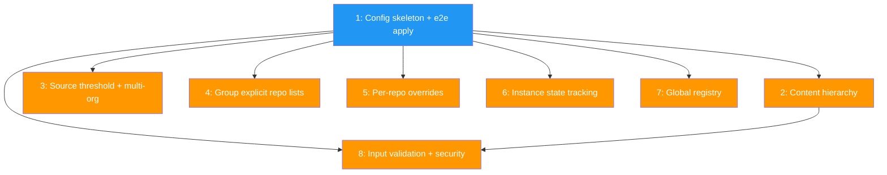

# PLAN: Workspace config format

## Status

Draft

## Scope Summary

Implements the workspace.toml TOML schema for niwa: source-based repo discovery from GitHub orgs, group classification by visibility or explicit listing, convention-driven CLAUDE.md hierarchy placement, hooks/settings/env distribution with per-repo overrides, instance state tracking, global registry, and input validation. The config lives in .niwa/ at the workspace root.

## Decomposition Strategy

**Walking skeleton.** The design describes a new end-to-end pipeline (parse config, discover repos from GitHub, classify into groups, clone, install content hierarchy) with multiple interacting components. A walking skeleton proves the full pipeline works early, then refinement issues thicken each layer independently. Issues 2-7 are parallel after the skeleton; issue 8 depends on both the skeleton and content hierarchy.

## Issue Outlines

### Issue 1: feat(config): implement workspace config skeleton with end-to-end apply

**Goal:** Build a minimal end-to-end `niwa apply` pipeline: parse workspace.toml with one source and two groups, query GitHub for repos, classify by visibility, clone into group directories, and write workspace-level CLAUDE.md. Stubs for features refined later.

**Acceptance Criteria:**
- [ ] Parse `.niwa/workspace.toml` into Go structs covering `[workspace]`, `[[sources]]`, `[groups]` with visibility filter, and `[content.workspace]`
- [ ] Unparsed sections (`[repos]`, `[hooks]`, `[settings]`, `[env]`, `[channels]`) parse into placeholder types without error
- [ ] Config discovery walks up from cwd looking for `.niwa/workspace.toml`
- [ ] Query GitHub API for repos in each source org (client injected as interface for testing)
- [ ] Classify repos into groups by visibility; no-match warns, multi-match errors
- [ ] Clone each classified repo into `{instance_root}/{group}/{repo}/`
- [ ] Read workspace content source file, write to `{instance_root}/CLAUDE.md` with stub template expansion
- [ ] `niwa apply` wired to cobra CLI
- [ ] Unit tests for parsing, classification, and integration test with mocked GitHub client

**Dependencies:** None

---

### Issue 2: feat(config): add content hierarchy with convention-driven placement

**Goal:** Implement the full four-level content hierarchy (workspace, group, repo, subdirectory) with convention-driven placement, template variable expansion, auto-discovery from `content_dir`, and gitignore pattern warnings.

**Acceptance Criteria:**
- [ ] Group content: `[content.groups.<name>]` produces `CLAUDE.md` in group directory
- [ ] Repo content: `[content.repos.<name>]` produces `CLAUDE.local.md` in repo directory
- [ ] Subdirectory content: `[content.repos.<name>.subdirs]` produces `CLAUDE.local.md` in subdirectories
- [ ] Source paths resolve relative to `content_dir`
- [ ] Template expansion replaces `{workspace}`, `{workspace_name}`, `{repo_name}`, `{group_name}` via plain string replacement
- [ ] Auto-discovery: repos without explicit content entries use `{content_dir}/repos/{repo_name}.md` if present
- [ ] Gitignore warning when writing CLAUDE.local.md to repo without `*.local*` pattern
- [ ] E2E flow still works
- [ ] Unit tests for each placement convention, template expansion, auto-discovery, gitignore warning

**Dependencies:** Issue 1

---

### Issue 3: feat(config): add source auto-discovery threshold and multi-org support

**Goal:** Enforce the `max_repos` threshold (default 10), support per-source explicit repo lists, and allow multiple `[[sources]]` for multi-org workspaces.

**Acceptance Criteria:**
- [ ] Org exceeding `max_repos` produces clear error suggesting override or explicit listing
- [ ] Per-source `max_repos` overrides the default for that source only
- [ ] Source with explicit `repos` list skips GitHub API discovery
- [ ] Multiple sources combine repos into single set for classification
- [ ] Cross-source duplicate repo names produce an error
- [ ] E2E flow still works
- [ ] Unit tests for threshold, override, explicit list, multi-source merge, duplicate detection

**Dependencies:** Issue 1

---

### Issue 4: feat(config): add group classification with explicit repo lists

**Goal:** Support groups with explicit `repos` lists as alternative to visibility filter. Enforce no-match exclusion with warning and multi-match error.

**Acceptance Criteria:**
- [ ] `repos = [...]` field parses on GroupConfig
- [ ] Group with only `repos` classifies listed repos correctly
- [ ] Group with both `visibility` and `repos` matches either criterion
- [ ] No-match repos excluded with warning; multi-match repos error with conflicting group names
- [ ] E2E flow still works
- [ ] Unit tests for explicit-only, mixed, no-match, multi-match

**Dependencies:** Issue 1

---

### Issue 5: feat(config): add per-repo overrides

**Goal:** Implement `[repos]` section for per-repo overrides with overlay semantics: repo wins for settings/env vars, extend for hooks, `claude = false` skips config generation.

**Acceptance Criteria:**
- [ ] `[repos.<name>]` parses into RepoOverride with all fields (url, branch, scope, claude, hooks, settings, env)
- [ ] `claude = false` skips CLAUDE.local.md and hooks/settings/env for that repo
- [ ] Settings/env vars: repo wins; env files: append; hooks: extend
- [ ] Per-repo url and branch override clone defaults
- [ ] Unknown repo names in `[repos]` produce warning
- [ ] E2E flow still works
- [ ] Unit tests for each overlay semantic

**Dependencies:** Issue 1

---

### Issue 6: feat(config): add instance state tracking

**Goal:** Implement `.niwa/instance.json` with managed file hashes for drift detection, instance metadata, repo clone state, instance discovery (walk-up), and enumeration (scan siblings).

**Acceptance Criteria:**
- [ ] `niwa apply` writes `.niwa/instance.json` with schema_version, config_name, instance_name, instance_number, root, created, last_applied
- [ ] managed_files tracks path, sha256 hash, generated timestamp for each written file
- [ ] repos map tracks URL and cloned status
- [ ] Drift detection: warn if managed file hash doesn't match before overwrite
- [ ] Instance discovery walks up from path to find nearest `.niwa/instance.json`
- [ ] Instance enumeration scans workspace root subdirectories for `.niwa/` markers
- [ ] Numbering uses max(existing) + 1
- [ ] Detached workspaces use config_name: null, detached: true
- [ ] E2E flow still works
- [ ] Unit tests for state creation, update, drift detection, discovery, enumeration, detached

**Dependencies:** Issue 1

---

### Issue 7: feat(config): add global registry

**Goal:** Implement `~/.config/niwa/config.toml` with `[global]` settings and `[registry.<name>]` entries for workspace name resolution.

**Acceptance Criteria:**
- [ ] Parse config.toml with [global] (clone_protocol) and [registry.<name>] (source, root)
- [ ] Respects XDG_CONFIG_HOME, falls back to ~/.config/niwa/config.toml
- [ ] Registry lookup returns root path and source for a workspace name
- [ ] `niwa apply` accepts optional workspace name resolved through registry
- [ ] Registry write: updates entry after successful apply
- [ ] Missing config file treated as empty defaults
- [ ] clone_protocol available to clone step, defaults to https
- [ ] E2E flow still works
- [ ] Unit tests for parsing, lookup, missing file, clone_protocol default

**Dependencies:** Issue 1

---

### Issue 8: feat(config): add input validation and security hardening

**Goal:** Add name validation, path traversal prevention, symlink-aware containment checks, and plain string replacement enforcement for template expansion.

**Acceptance Criteria:**
- [ ] Name validation: group/repo/subdir names must match `[a-zA-Z0-9._-]+`; clear error on failure
- [ ] Path traversal: content source paths must resolve within content_dir; reject `..` and absolute components
- [ ] Subdirectory key containment: must resolve within repo directory
- [ ] Symlink-aware: `filepath.EvalSymlinks` before containment checks
- [ ] Template expansion verified to use plain string replacement only (no text/template)
- [ ] Validation errors include offending value and rule
- [ ] E2E flow still works
- [ ] Unit tests for each rule with accepted and rejected inputs

**Dependencies:** Issue 1, Issue 2

## Dependency Graph

**Legend:** Blue = ready to start, Orange = blocked by dependencies

## Implementation Sequence

**Critical path:** Issue 1 -> Issue 2 -> Issue 8 (3 issues deep)

**Recommended order:**

1. **Start with Issue 1** (skeleton) -- proves the full pipeline end-to-end
2. **After Issue 1, work Issues 2-7 in any order** -- all are independent refinements:
   - Issue 2 (content hierarchy) is on the critical path, so prioritize it
   - Issues 3, 4 (source/group refinements) are closely related, could be done together
   - Issues 5, 6, 7 (overrides, state, registry) are fully independent
3. **Issue 8 last** -- depends on both skeleton and content hierarchy being complete
