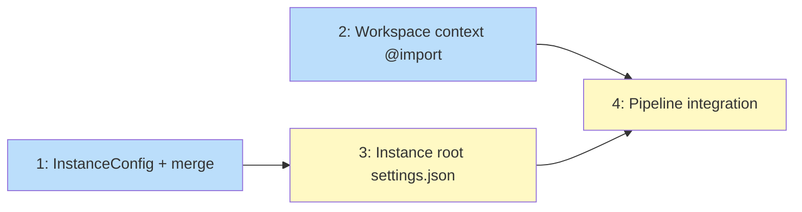

# PLAN: Workspace Root Claude Configuration

## Status

Draft

## Scope Summary

Configure Claude Code at the workspace instance root with level-scoped context
via @import, declarative settings.json (hooks, permissions, env, plugins,
marketplaces), and an [instance] override section in workspace.toml.

## Decomposition Strategy

**Horizontal.** Config types first, then context generation, then settings
generation, then integration. Issues 1 and 2 are independent; 3 depends on
both; 4 wires everything together.

## Issue Outlines

### 1. Add InstanceConfig type and merge

**Goal:** Add `[instance]` section to workspace.toml with the same override
fields as `[repos.X]`. Implement `MergeInstanceOverrides` that resolves
effective config for the instance root.

**Acceptance criteria:**
- `InstanceConfig` struct with `Claude *ClaudeConfig`, `Env EnvConfig`,
  `Files map[string]string`
- `WorkspaceConfig.Instance` field (`toml:"instance,omitempty"`)
- `MergeInstanceOverrides(ws) EffectiveConfig` uses same merge semantics
  as `MergeOverrides`: hooks extend, settings replace per key, plugins
  replace (nil inherits), env promote union, env vars replace
- Config parsing tests: instance section present, absent, partial overrides
- Scaffold template updated with commented `[instance]` example

**Dependencies:** None

**Complexity:** testable

### 2. Generate workspace-context.md with @import

**Goal:** Auto-generate `workspace-context.md` at the instance root listing
repos and groups. Prepend `@workspace-context.md` to the instance root's
`CLAUDE.md` so it's loaded at root level but not inherited by child repos.

**Acceptance criteria:**
- `InstallWorkspaceContext(cfg, classified, instanceRoot)` generates the file
- Content lists repos grouped by group name with paths
- `@workspace-context.md` prepended to CLAUDE.md if not already present
- If no CLAUDE.md exists, the import is skipped (no empty file created)
- File is tracked in managed files (returned in written files list)

**Dependencies:** None

**Complexity:** simple

### 3. Generate instance root settings.json

**Goal:** Generate `.claude/settings.json` at the instance root with hooks,
permissions, env, plugins, marketplaces, and `includeGitInstructions: false`.
Uses `MergeInstanceOverrides` for effective config.

**Acceptance criteria:**
- `InstallWorkspaceRootSettings(cfg, configDir, instanceRoot)` generates
  `.claude/settings.json` (not `.local` -- non-git directory)
- Includes: `permissions`, `hooks`, `env`, `enabledPlugins`,
  `extraKnownMarketplaces`, `includeGitInstructions: false`
- Hook scripts copied to `.claude/hooks/{event}/` without `.local` rename
  (non-git directory)
- `enabledPlugins` maps from `EffectiveConfig.Plugins` to `{id: true}`
- `extraKnownMarketplaces` maps from `ClaudeConfig.Marketplaces` to the
  format Claude Code expects (GitHub refs -> `{source: {source: "github", repo: ...}}`,
  `repo:` refs -> `{source: {source: "directory", path: ...}}`)
- Settings generation uses `MergeInstanceOverrides` for effective config
- Tests for: default config, instance override, hooks copied, plugins mapped

**Dependencies:** <<ISSUE:1>> (MergeInstanceOverrides)

**Complexity:** testable

### 4. Pipeline integration

**Goal:** Wire context generation and settings generation into the apply
pipeline as Step 4.5, after workspace CLAUDE.md but before group/repo content.

**Acceptance criteria:**
- Step 4.5 calls `InstallWorkspaceContext` and `InstallWorkspaceRootSettings`
- Written files included in managed files tracking
- Plugin install at instance root removed (replaced by declarative
  `enabledPlugins` in settings.json)
- Existing tests still pass
- E2E: `niwa create` produces workspace-context.md, settings.json with all
  fields, hook scripts at instance root

**Dependencies:** <<ISSUE:2>>, <<ISSUE:3>>

**Complexity:** simple

## Dependency Graph

**Legend**: Blue = ready, Yellow = blocked

## Implementation Sequence

Issues 1 and 2 are independent and can be done in parallel. Issue 3 depends
on 1 (needs MergeInstanceOverrides). Issue 4 wires 2 and 3 into the pipeline.

Critical path: 1 -> 3 -> 4 (issue 2 can be done anytime before 4).
