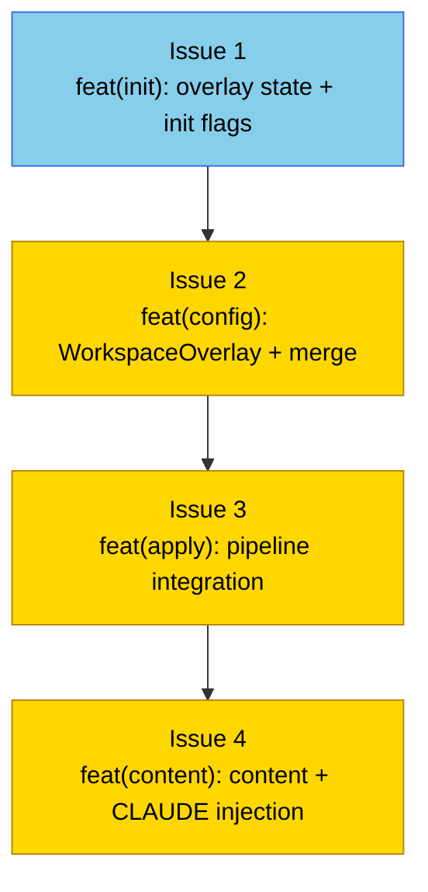

# PLAN: Workspace overlay

## Status

Draft

## Scope Summary

Adds a workspace overlay layer to the niwa apply pipeline: a convention-derived or
explicitly-specified companion repo whose additive config (sources, groups, repos,
content, hooks) is merged between the workspace config load and GlobalOverride
application, giving users with access to the overlay a richer workspace while users
without access see only the base config with no indication the overlay exists.

## Decomposition Strategy

**Horizontal** — The design's four implementation phases map directly to four issues
in a strict serial dependency chain. Each phase delivers independently testable
components that the next phase consumes. Walking skeleton was not used because the
dependency chain is fully ordered: state schema must exist before the config type can
reference OverlayDir, which must exist before the pipeline can call MergeWorkspaceOverlay,
which must exist before content generation can append OverlaySource content.

## Issue Outlines

### Issue 1: feat(init): add overlay state fields and init flags for workspace overlay

**Complexity**: testable

**Goal**: Add `OverlayURL`, `NoOverlay`, and `OverlayCommit` fields to `InstanceState`, wire `--overlay` and `--no-overlay` flags into `niwa init`, implement convention URL derivation and XDG clone directory resolution, and perform the initial overlay clone at init time.

**Acceptance Criteria**:
- [ ] `InstanceState` in `internal/workspace/state.go` gains three new fields: `OverlayURL string` (`json:"overlay_url,omitempty"`), `NoOverlay bool` (`json:"no_overlay,omitempty"`), and `OverlayCommit string` (`json:"overlay_commit,omitempty"`)
- [ ] `niwa init` accepts `--overlay <repo>` (string flag) and `--no-overlay` (bool flag); the two flags are mutually exclusive and produce an error if both are supplied
- [ ] `deriveOverlayURL(sourceURL string) (conventionURL string, ok bool)` in `internal/config/overlay.go` returns `<org>/<repo>-overlay` for HTTPS URLs, SSH URLs, and shorthand (`org/repo`); returns `ok=false` for inputs that cannot be parsed
- [ ] `OverlayDir(overlayURL string) (string, error)` in `internal/config/overlay.go` returns `$XDG_CONFIG_HOME/niwa/overlays/<org>-<repo>/`; falls back to `$HOME/.config/niwa/overlays/<org>-<repo>/` when `XDG_CONFIG_HOME` is unset
- [ ] `CloneOrSyncOverlay(url, dir string) (firstTime bool, err error)` clones when `dir` does not exist or contains no valid git repo (`firstTime=true`), and pulls with `--ff-only` when a valid clone is present (`firstTime=false`)
- [ ] `--overlay <repo>`: `runInit` calls `CloneOrSyncOverlay`, writes `OverlayURL` and `OverlayCommit` (HEAD SHA) on success, returns error on failure
- [ ] Convention discovery (no `--overlay` flag, `modeClone`): derive URL, print to stdout, clone, write `OverlayURL` and `OverlayCommit` on success, silently skip on `firstTime=true` error
- [ ] `--no-overlay`: writes `NoOverlay=true` to state, skips all overlay discovery
- [ ] Convention discovery failure: prints note recommending the workspace publisher create a companion `<repo>-overlay` repository
- [ ] Unit tests cover: URL derivation for all input forms; `OverlayDir` with and without `XDG_CONFIG_HOME`; mutual-exclusion error; `--no-overlay` state; `--overlay` success writes both fields; convention discovery silent-skip does not write `OverlayURL`

**Dependencies**: None

---

### Issue 2: feat(config): add WorkspaceOverlay config type and MergeWorkspaceOverlay

**Complexity**: critical

**Goal**: Implement the `WorkspaceOverlay` config type, `ParseOverlay()`, and `MergeWorkspaceOverlay()` so that downstream pipeline and content-install code can consume overlay configuration safely.

**Acceptance Criteria**:
- [ ] `WorkspaceOverlay`, `OverlayClaudeConfig`, `OverlayContentConfig`, and `OverlayContentRepoConfig` structs defined in `internal/config/overlay.go` with TOML tags matching the design
- [ ] `ContentRepoConfig` in `internal/config/config.go` gains `OverlaySource string` tagged `toml:"-"` (never parsed from TOML, only set by merge)
- [ ] `ParseOverlay(path string) (*WorkspaceOverlay, error)` rejects:
  - Absolute paths and `..` components in all path fields (reusing `validateGlobalOverridePaths`)
  - Hook script paths that are not relative (validated before `MergeWorkspaceOverlay` resolves them)
  - `[files]` destination paths beginning with `.claude/` or `.niwa/`
  - Content entries where both `source` and `overlay` are set, or neither is set
  - Sources without an explicit `repos` list (no auto-discovery)
- [ ] `MergeWorkspaceOverlay(ws *WorkspaceConfig, overlay *WorkspaceOverlay, overlayDir string) (*WorkspaceConfig, error)`:
  - Deep-copies the input `WorkspaceConfig` (does not mutate)
  - Applies base-wins collision semantics for groups, repos, settings, env vars, and files (per-key)
  - Returns error when overlay adds a source with an org already present in the base config
  - Resolves hook script paths to absolute paths via `filepath.Join(overlayDir, scriptPath)`
  - Confirms each resolved hook path is within `overlayDir` using a symlink-resolving containment check (`resolveExistingPrefix` / `checkContainment`)
  - Sets `ContentRepoConfig.OverlaySource` on merged entries that originate from the overlay
- [ ] Unit tests cover: `ParseOverlay` rejection of all prohibited forms; `MergeWorkspaceOverlay` collision handling, hook resolution, duplicate-org error, and `OverlaySource` propagation

**Dependencies**: Blocked by Issue 1

---

### Issue 3: feat(apply): integrate overlay layer into niwa apply pipeline

**Complexity**: testable

**Goal**: Wire the overlay clone, parse, and merge steps into `runPipeline()` as steps 2.5–2.6, so that downstream pipeline steps receive a `mergedWS` that includes overlay repos, groups, sources, and content.

**Acceptance Criteria**:
- [ ] `Applier` struct in `internal/workspace/apply.go` carries `overlayDir string` (set during step 2.5, used in steps 2.6, 4.5, and 6)
- [ ] `runApply()` reads `OverlayURL` and `NoOverlay` from `InstanceState` and passes them to `runPipeline()`
- [ ] `runPipeline()` implements step 2.5 with branching:
  - `NoOverlay=true`: skip steps 2.5 and 2.6 entirely
  - `OverlayURL` set in state: `CloneOrSyncOverlay`; on `firstTime=false` error, return non-revealing message: `"workspace overlay sync failed. Use --no-overlay to skip."`
  - Neither: derive convention URL from `RegistryEntry.Source`; `CloneOrSyncOverlay`; on `firstTime=true` error, skip silently
- [ ] Convention discovery success: write `OverlayURL` and `OverlayCommit` (HEAD SHA) to `InstanceState` and call `SaveState` before proceeding
- [ ] When `OverlayURL` was set in state and overlay HEAD SHA differs from `OverlayCommit`, emit a warning to stderr (not a hard error)
- [ ] `runPipeline()` implements step 2.6: when `overlayDir` non-empty, call `ParseOverlay` then `MergeWorkspaceOverlay`; returned `mergedWS` replaces `ws` for all subsequent steps
- [ ] `overlayDir` available in pipeline context for Issue 4's `InstallOverlayClaudeContent` call (step 4.5) and extended `InstallRepoContent` call (step 6)
- [ ] Integration tests: apply with valid overlay (overlay repos/groups/content appear); apply with `NoOverlay=true` (base config only, no overlay functions called); apply with previously-set `OverlayURL` and `NoOverlay=true` (state field respected)

**Dependencies**: Blocked by Issue 2

---

### Issue 4: feat(content): overlay content append and CLAUDE.overlay.md injection

**Complexity**: testable

**Goal**: Extend content generation to append overlay content to `CLAUDE.local.md` files and inject `CLAUDE.overlay.md` into the workspace root, completing the overlay pipeline.

**Acceptance Criteria**:
- [ ] `InstallRepoContent()` in `internal/workspace/content.go` checks `cfg.Claude.Content.Repos[repo].OverlaySource` after writing base `CLAUDE.local.md`; when non-empty, reads `<overlayDir>/<OverlaySource>`, appends to `CLAUDE.local.md` separated by a blank line
- [ ] `overlayDir` parameter threaded into `InstallRepoContent()` (or available via pipeline context)
- [ ] When `OverlaySource` is set but `overlayDir` is empty, `InstallRepoContent` returns an error
- [ ] `InstallOverlayClaudeContent(overlayDir, instanceRoot string) error` added to `internal/workspace/workspace_context.go`:
  - Copies `<overlayDir>/CLAUDE.overlay.md` to `<instanceRoot>/CLAUDE.overlay.md` when present
  - Returns nil when `CLAUDE.overlay.md` is absent from overlay clone
  - Injects `@CLAUDE.overlay.md` into `CLAUDE.md` after `@workspace-context.md` and before `@CLAUDE.global.md`
  - Returns the installed path for caller to add to `writtenFiles` (and therefore `ManagedFiles`)
- [ ] Import ordering enforced: `@workspace-context.md` → `@CLAUDE.overlay.md` → `@CLAUDE.global.md`
- [ ] `runPipeline()` calls `InstallOverlayClaudeContent(overlayDir, instanceRoot)` at step 4.5 when `overlayDir` non-empty; returned path appended to `writtenFiles`
- [ ] `SettingsMaterializer.Materialize()` in `internal/workspace/materialize.go` calls `CheckGitignore(repoDir, repoName)` whenever `settings.local.json` is written; warnings surfaced in apply output (not errors)
- [ ] Tests: CLAUDE.local.md with overlay (both parts present, blank-line separated); without overlay (no regression); `OverlaySource` set + empty `overlayDir` → error; CLAUDE.overlay.md present → copied and import injected at correct position; CLAUDE.overlay.md absent → nil return, CLAUDE.md unmodified; import ordering when both workspace-context and global imports already present; `CheckGitignore` warning for missing `*.local*` pattern in `.gitignore`

**Dependencies**: Blocked by Issue 3

## Dependency Graph

Legend: Blue = ready to start, Yellow = blocked by dependency

## Implementation Sequence

**Critical path**: Issue 1 → Issue 2 → Issue 3 → Issue 4 (all 4 issues; no parallelization possible)

**Recommended order**:
1. **Issue 1** (no dependencies) — lays the InstanceState schema and init primitives that all subsequent issues build on
2. **Issue 2** (blocked by 1) — security-critical; all path validation and merge logic lives here; must be correct before pipeline integration begins
3. **Issue 3** (blocked by 2) — threads the overlay layer into runPipeline; delivers the integration point that Issue 4 extends
4. **Issue 4** (blocked by 3) — completes the feature by wiring content generation and CLAUDE injection

**Notes for implementers**:
- Issue 2 is classified `critical` because it contains all security-sensitive path validation (hook script relativity, symlink containment, `.claude/` and `.niwa/` destination rejection). Review it carefully before merging.
- The `OverlayCommit` warn-on-advance in Issue 3 is a warning, not an error — do not change it to a hard error.
- The `CLAUDE.overlay.md` import in Issue 4 must be positioned between `@workspace-context.md` and `@CLAUDE.global.md`; the existing `ensureImportInCLAUDE` may need extension if it only supports prepend.
- All four issues ship in a single PR on the `docs/workspace-visibility-overlay` branch.
