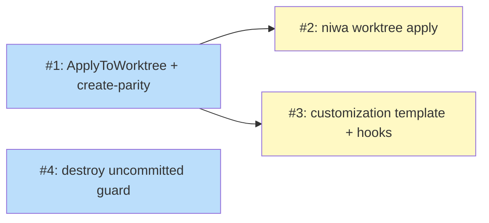

# PLAN: worktree command parity

## Status

Draft

## Scope Summary

Bring `niwa worktree` to symmetric parity with `niwa create|apply|destroy`: install
repo-equivalent CLAUDE content into a created worktree, add a `niwa worktree apply`
re-sync analog, a per-worktree customization surface, and a destroy uncommitted-work
guard — all reusing the existing workspace installers via a new
`workspace.ApplyToWorktree` entry point (keeping `internal/worktree/` a leaf).

## Decomposition Strategy

**Horizontal, single-PR mode.** This is layered enrichment of an existing command
group, not a new end-to-end pipeline, so there is no walking skeleton. The four
outlines map 1:1 to the design's Implementation Approach phases. They are sequenced
by a single foundational dependency: Issue 1 introduces `workspace.ApplyToWorktree`
and wires it into `niwa worktree create`; Issues 2 and 3 extend that entry point;
Issue 4 is independent (a guard on `destroy`).

This plan is recorded in **single-pr mode** (no GitHub issues/milestone created) per
the maintainer's intent to identify and sequence the work without committing it to
issues yet — and because not all of it is intended to land in the current branch.
Each outline is independently useful and could be promoted to its own PR/issue when
the team executes; Issue 1 (create-parity) is the natural first slice.

## Issue Outlines

### Issue 1: workspace.ApplyToWorktree + create-parity wiring

**Goal**: Add a `workspace.ApplyToWorktree` entry point that installs the owning
repo's CLAUDE content (and a workspace-context rules import + a default
purpose/branch layer) into a worktree by reusing the existing installers, and wire
`niwa worktree create` to call it after `worktree.CreateSession`.

**Acceptance Criteria**:
- [ ] New `workspace.ApplyToWorktree(...)` reuses `InstallRepoContent` + the repo
      materializers against the worktree path (no forked installer).
- [ ] It writes `<worktree>/.claude/rules/worktree-imports.md` with an absolute
      `@import` to the instance `workspace-context.md` (via the existing
      `writeWorkspaceRulesFile`), plus overlay/global where present.
- [ ] It appends a default worktree-specific layer naming the purpose and branch.
- [ ] `niwa worktree create <repo> <purpose>` calls it after `CreateSession`; the
      worktree ends up with the same class of accessories a repo checkout has after
      `niwa apply` (assert file-for-file against the repo-level install).
- [ ] `internal/worktree/` still imports neither `internal/workspace` nor any deleted
      package (leaf preserved; verified via `go list -deps`).
- [ ] A `@critical` functional scenario: after `niwa worktree create`, the worktree
      contains `CLAUDE.local.md`, the worktree rules import, and the purpose/branch
      layer.
- [ ] `go build/vet/test ./...` pass; instance-command behavior unchanged.

**Dependencies**: None

**Type**: code
**Files**: `internal/workspace/` (new ApplyToWorktree), `internal/cli/session_lifecycle_cmd.go`, `internal/worktree/worktree.go` (expose path/branch/purpose if needed), `test/functional/features/`

### Issue 2: niwa worktree apply (idempotent re-sync)

**Goal**: Add the `niwa worktree apply <session-id>` command — the worktree analog of
`niwa apply` — that resolves an existing worktree from session state and re-runs
`workspace.ApplyToWorktree` idempotently.

**Acceptance Criteria**:
- [ ] `niwa worktree apply <session-id>` exists, registered under the worktree
      command group (and reachable via the `session` alias).
- [ ] It resolves the worktree path/branch/purpose from session lifecycle state and
      calls `ApplyToWorktree` (no `CreateSession`).
- [ ] Running it twice is idempotent (second run produces no spurious changes).
- [ ] Running it after a workspace config change updates the worktree's content.
- [ ] `go build/vet/test ./...` pass; a functional scenario covers the idempotent
      re-sync.

**Dependencies**: Blocked by <<ISSUE:1>>

**Type**: code
**Files**: `internal/cli/` (new worktree apply command + registration), `internal/workspace/` (reuse ApplyToWorktree), `test/functional/features/`

### Issue 3: worktree customization surface (template + hooks)

**Goal**: Add the `[claude.content.worktree]` content template (expanded with
worktree variables `{purpose}`/`{branch}`/`{repo_name}`/`{worktree_path}`) and a
worktree-event hook discovery surface, so maintainers can shape the worktree layer
without editing code — the counterpart of instance content customization.

**Acceptance Criteria**:
- [ ] `internal/config/` gains an optional `[claude.content.worktree].source` entry
      (additive; absent = the Issue 1 default layer).
- [ ] `ApplyToWorktree` renders the worktree layer from the template when configured,
      expanding the worktree template variables (routed through the existing
      containment-checked installer; `purpose` never interpolated into a path).
- [ ] A worktree-event hook directory is discovered and run on create/apply (analog
      of `DiscoverHooks`).
- [ ] A configured template demonstrably shapes the worktree's context (functional or
      unit test); unset config falls back to the default layer.
- [ ] `go build/vet/test ./...` pass.

**Dependencies**: Blocked by <<ISSUE:1>>

**Type**: code
**Files**: `internal/config/`, `internal/workspace/` (template expansion + hook discovery), `test/functional/features/` or unit tests

### Issue 4: worktree destroy uncommitted-work guard

**Goal**: Bring `niwa worktree destroy` to destroy-symmetry with the instance level by
warning on uncommitted/unpushed work in the worktree before removal unless `--force`
(mirroring `CheckUncommittedChanges`).

**Acceptance Criteria**:
- [ ] `niwa worktree destroy` checks the worktree for uncommitted/unpushed work and
      refuses (with a clear message) unless `--force`.
- [ ] The existing attach-lock guard, branch-delete, and idempotent-terminal behavior
      are preserved.
- [ ] A functional scenario covers destroy-refuses-on-dirty and `--force`-overrides.
- [ ] `go build/vet/test ./...` pass.

**Dependencies**: None (independent of Issues 1-3; touches only the destroy path)

**Type**: code
**Files**: `internal/cli/session_lifecycle_cmd.go`, `internal/worktree/worktree.go` (or a workspace dirty-check helper), `test/functional/features/`

## Implementation Issues

Not applicable in single-pr mode — no GitHub issues or milestone are created. The
Issue Outlines above are the decomposition. When the team executes, each outline can
be promoted to its own PR/issue (the work is intended to span more than one branch).

## Dependency Graph

**Legend**: Green = done, Blue = ready, Yellow = blocked.

## Implementation Sequence

- **Issue 1** is the foundational, load-bearing slice (the shared
  `workspace.ApplyToWorktree` + create-parity). It is the natural first PR and the
  one most worth landing early — it delivers the create-parity the requirement
  started from and establishes the shared code path that prevents divergence.
- **Issue 4** is independently `ready` and can land in parallel with Issue 1 (it
  only touches the destroy path).
- **Issues 2 and 3** unblock once Issue 1 lands; both extend `ApplyToWorktree`
  (Issue 2 adds the re-sync command, Issue 3 the customization surface) and can then
  proceed in parallel.

Critical path: Issue 1 → (Issue 2, Issue 3). Issue 4 is off the critical path.
