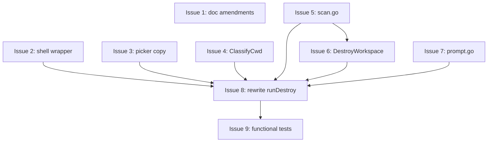

# Plan Dependencies: niwa-destroy

## Dependency graph (Mermaid)

## Critical path

`<<ISSUE:5>>` → `<<ISSUE:6>>` → `<<ISSUE:8>>` → `<<ISSUE:9>>`

Length: 4 sequential issues. Total estimated effort: ~1 focused session each = ~4 sessions on the critical path.

## Parallelization opportunities

- `<<ISSUE:1>>` (docs) — fully independent, can land any time.
- `<<ISSUE:2>>` (wrapper), `<<ISSUE:3>>` (picker), `<<ISSUE:4>>` (classify), `<<ISSUE:7>>` (prompt) — independent of each other; can interleave with `<<ISSUE:5>>`+`<<ISSUE:6>>` on the critical path.
- `<<ISSUE:5>>` — gates `<<ISSUE:6>>` only.
- All work converges at `<<ISSUE:8>>`.

## Implementation sequence (recommended for single-pr delivery)

Since this is single-pr (one developer, one branch, one PR), there's no actual parallelization — issues land sequentially on the same branch. Recommended order:

1. **Doc amendments** (`<<ISSUE:1>>`) — safe and small, sets the spec context.
2. **Shell wrapper** (`<<ISSUE:2>>`) — small, independent.
3. **Picker copy** (`<<ISSUE:3>>`) — independent.
4. **`ClassifyCwd`** (`<<ISSUE:4>>`) — independent.
5. **`scan.go`** (`<<ISSUE:5>>`) — independent.
6. **`DestroyWorkspace`** (`<<ISSUE:6>>`) — needs `<<ISSUE:5>>`.
7. **`prompt.go`** (`<<ISSUE:7>>`) — independent.
8. **Rewrite `runDestroy`** (`<<ISSUE:8>>`) — needs all of 2–7.
9. **Functional tests** (`<<ISSUE:9>>`) — needs `<<ISSUE:8>>`.

Issues 1, 2, 3, 4, 7 could land in any order; 5 must precede 6; 8 must follow 2–7; 9 must follow 8.
